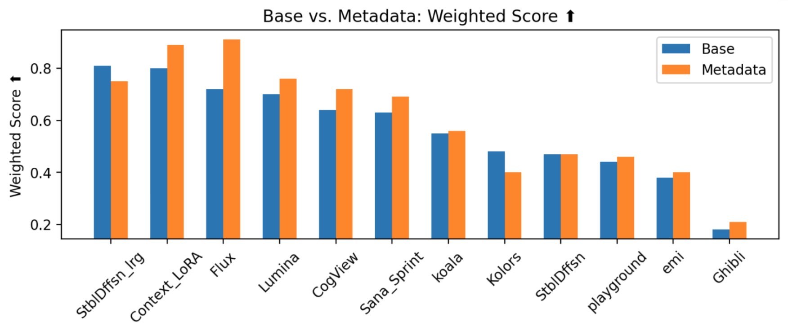

## Demo App

## System Architecture

## Evaluation Results

# Disclaimer
- Precision@3 wasn't printed because in a one-to-one matching scenario—where each generated image corresponds to exactly one ground truth image—Precision@3 becomes redundant. In this context, if the correct match is in the top 3, both Precision@3 and Recall@3 would reflect a "hit." Thus, we focus on Recall@3 (and MRR) to measure retrieval performance without adding redundant metrics.