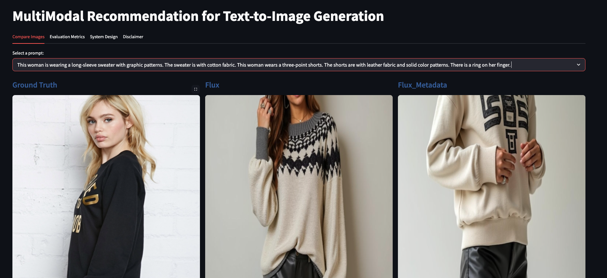
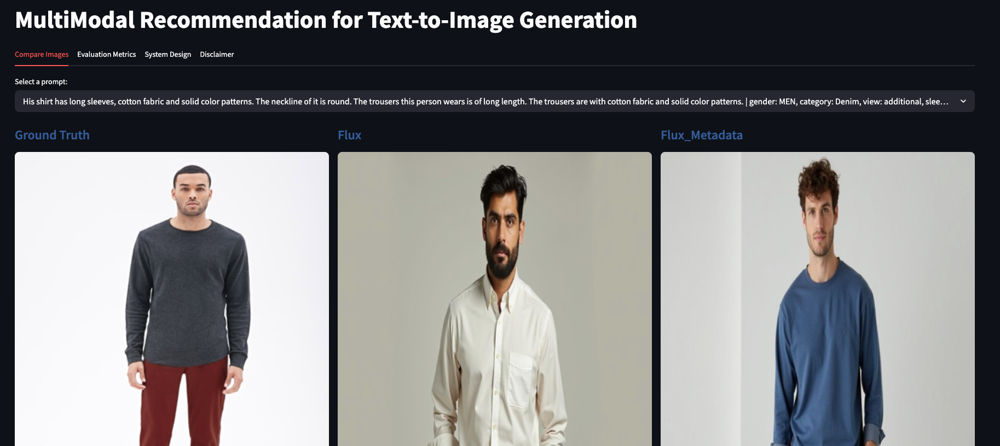
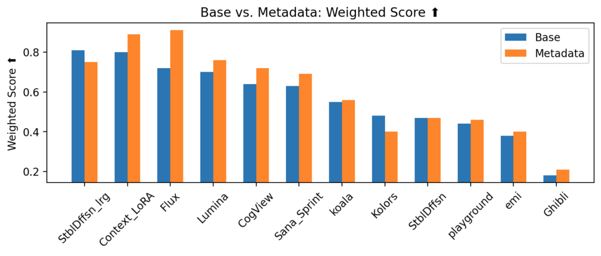

[](https://doi.org/10.5281/zenodo.15385124)

# 🖼️ Evaluation of Text-to-Image Generation Models

This project benchmarks and compares multiple state-of-the-art text-to-image generation models using the [DeepFashion MultiModal Dataset](https://github.com/switchablenorms/DeepFashion2).

---

## 🔧 Setup

```bash
pip install -r requirements.txt
```

---

## 🚀 Usage Guide

### 1. Generate Images from Text Prompts

```bash
python text2image_generation.py
```

- Generates images for each listed model using base and metadata-enhanced prompts.
- Saves images to `image_generated/`.

### 2. Evaluate Model Performance

```bash
python evaluation_pipeline.py
```

- Computes metrics like CLIP Score, LPIPS, FID, MRR, Recall@3, and Weighted Score.
- Saves evaluation results to `results/`.

### 3. Launch Interactive Visualization Dashboard

```bash
streamlit run visualization_app.py
```

- View and compare model performance using visual graphs.
- Explore system design, generated vs. ground-truth image comparisons, and model architecture insights.

## Demo App



## System Architecture


## Evaluation Results


## Citation

If you use this repository, models, or evaluation metrics in your research or applications, please cite:

```bibtex
@misc{wanaskar2025multimodalbenchmarkingrecommendationtexttoimage,
    title={Multimodal Benchmarking and Recommendation of Text-to-Image Generation Models},
    author={Kapil Wanaskar and Gaytri Jena and Magdalini Eirinaki},
    year={2025},
    eprint={2505.04650},
    archivePrefix={arXiv},
    primaryClass={cs.GR},
    url={https://arxiv.org/abs/2505.04650}
}
```

You can also use the [CITATION.cff](CITATION.cff) file in this repository for automated citation support (e.g., GitHub, Zenodo).


# Disclaimer
- Precision@3 wasn't printed because in a one-to-one matching scenario—where each generated image corresponds to exactly one ground truth image—Precision@3 becomes redundant. In this context, if the correct match is in the top 3, both Precision@3 and Recall@3 would reflect a "hit." Thus, we focus on Recall@3 (and MRR) to measure retrieval performance without adding redundant metrics.